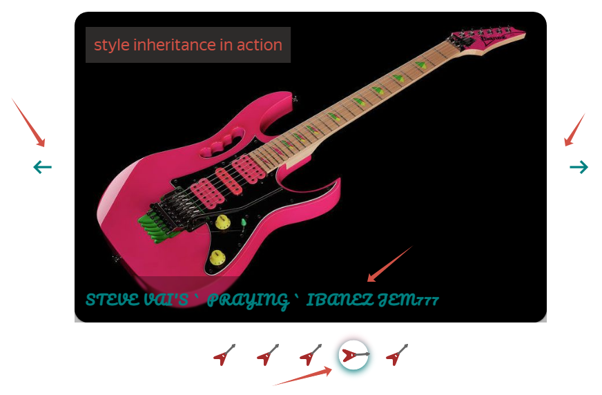

### GRI-slider is an image carousel, easy to integrate into your Javascript project

#### The following technologies were used in the development

1. scss / css - to create base styles;
2. vanilla js - to create logic and render the carousel
3. TS - for type checking;

#### 0. All source-code stored in the **"gri-slider"** folder

- index.min.css --> pre-prepared css styles (default);
- index.js --> js-file which re-exports main Slider class and other required utils;
- fonts --> some local fonts, already integrated in default css-file
- types --> empty folder, generated after ts compilation

### SEE PREVIEW [RIGHT NOW!!](https://rakoth-gri.github.io/gri_slider/ "GRI_SLIDER IN ACTION")!

#### 1. Three simple steps to connect a carousel to your project

1. Create an HTML-markup in your index.html file with with pre-prepared classes:

```html
<section class="gri-slider">
  <!-- click for previous slide -->
  <div class="gri-slider__prev">
    <span class="material-symbols-outlined gri-slider__prev_el" id="prev">
      arrow_left_alt
    </span>
  </div>
  <!-- container with carousel inside -->
  <div class="gri-slider__body">
    <!-- RENDER -->
  </div>
  <!-- click for the next slide -->
  <div class="gri-slider__next">
    <span class="material-symbols-outlined gri-slider__next_el" id="next">
      arrow_right_alt
    </span>
  </div>
</section>
```

2. Add a pre-prepared css-file in the head element of your markup:

```html
<head>
  <!-- other meta content -->
  <!-- specify root to gri-slider folder in your project -->
  <link rel="stylesheet" href="./gri-slider/index.min.css" />
</head>
```

3. Import AutoSlider class as shown below:

- enabling javascript to html with **recommended attributes**:

```html
<head>
  <!-- specify the root to your index.js file: -->
  <script src="./index.js" defer type="module"></script>
</head>
```

- inside index.js:

```javascript
// specify the root to 'gri-slider' folder in your project:
import AutoSlider from "./gri-slider/index.js";

// invoke the AutoSlider class with options:
new AutoSlider({
  list: MY_SLIDE_LIST, // required
  csssd: { fontFamily: "Montserrat", color: "orangered" }, // optional
  isAutoSlider: true, // optional
  panel: ["renderDots"], // optional
  imgInSlideCount: 1, // optional
});
```

- the most simple way to start using Slider:

```javascript
// specify the root to 'gri-slider' folder in your project:
import AutoSlider from "./gri-slider/index.js";
new AutoSlider({ list: MY_SLIDE_LIST });
```

#### 2. PROPERTIES ---

#### 2.1 'list' - the only required prop for creating a dynamic carousel. This is an Array of objects kind of:

```javascript
const MY_SLIDE_LIST = [
  {
    // required prop
    slideImg: "https://remote-site.com/picture1.jpg",
    // optional prop
    comment: "comment for picture1",
    // optional prop
    controlImg: "./src/my-icons/icon.svg",
  },
  {
    slideImg: "https://remote-site.com/picture2.jpg",
  },
  {
    slideImg: "https://remote-site.com/picture3.jpg",
    comment: "comment for picture3",
  },
];

new AutoSlider({ list: MY_SLIDE_LIST });
```

As we can see above, each item of **MY_SLIDE_LIST** potentially has three props:

- **slideImg** defines the path to the picture of carousel
- **comment** defines the comment to a specific picture
- **controlImg** defines the root of the icon for slider panel customizing. **You should always pass 'controlImg' prop only in zero-index item of 'list' array**

Typing for each prop in the **'list'** item:

```typescript
interface I_LIST_ITEM {
  // required prop
  slideImg: string;
  // optional prop
  comment: string | null | undefined;
  // optional prop
  controlImg: string | null | undefined;
}
```

#### 2.2 'csssd' - the optional prop for customizing styles of main container (.gri-slider). This is a javascript CSS_Style_Declaration object:

```javascript
{
    fontFamily: "Montserrat", // inherited CSS-prop
    color: "orangered", // inherited-CSS prop
    width: '700px',
    textAlign: 'center' // inherited-CSS prop
}

new AutoSlider({
  list: SLIDE_LIST,
  csssd: { color: "teal", letterSpacing: "1.2px", fontFamily: "Pacifico, cursive" },
  panel: ["renderDots"],
});
```

Picture, that illustrates the csssd object styles above:


**By default: font of slider container (.gri-slider) is 'Montserrat'**

Types of values for a single prop in csssd object:

- **[CSSStyleProp]** --> string | number | undefined

Attention:

- **'csssd'** prop adds inline-styles for slider container (.gri-slider)
- **if the CSS-prop refers to inherited, slider container's children inherit the prop's value!**
  <br>

**By default: {}**

#### 2.3 'isAutoSlider' - the optional property, activates the automatic slides switching in carousel:

```javascript
new AutoSlider({
  list: MY_SLIDE_LIST, // required
  isAutoSlider: true, // optional
});
```

You can dynamically **stop / restart** the automatic slides change by **entering / leaving** mouse cursor to slider container area:


Types of values for the prop:

- **isAutoSlider** --> boolean | undefined

**By default: false**

#### 2.4 'imgInSlideCount' - the optional property which determines the number of images within a single slide:

```javascript
new AutoSlider({
  list: MY_SLIDE_LIST, // required
  imgInSlideCount: 2, // optional
});
```

- This picture demonstrates the code above:
  

Types of values for CSS-prop:

- **imgInSlideCount** --> number | undefined

**By default: 1**

#### 2.5 'panel' - the optional property which connects the slider control panel.

The property is a single-length string Array, determines the appearance of the control panel.

```javascript
new AutoSlider({
  list: MY_SLIDE_LIST, // required
  panel: ["renderDots"], // optional
});
```

Types of values for CSS-prop:

- **panel** --> ("renderDots" | "renderControls")[]

By the way, if the value is ['renderControls'] - you can also specify the icon for the control button: simply indicate the path for **controlImg** prop in zero-index item of **list** prop:

```javascript
const MY_SLIDE_LIST = [
  // zero-index item of 'list' Array!
  {
    slideImg: "https://remote-site.com/picture1.jpg",
    // specifing path to the icon:
    controlImg: "./src/icons/guitar.svg",
  },
];
```

- Panel with ["renderDots"[ value:
  

- Panel with ["renderControls"] value:
  

- Panel with ["renderControls"] value and with enable 'controlImg' prop:
  

**By default: disabled**

#### 2.6 'delay' - the optional property, allows you to set the frequency of slides switching in the carousel.

```javascript
new AutoSlider({
  list: MY_SLIDE_LIST, // required
  delay: 2000, // optional, in milliseconds
});
```

**By default: 1800**

#### 2.7 'arrows' - the optional property, helps to customize the apperance of gri-slider functional arrows:

- the customized part of the slider:
  


```javascript
new AutoSlider({
  list: MY_SLIDE_LIST, // required
  // connect your favourite icon font resourse, put html-code of chosen icons and don't FORGET
  // to complete code with functional classes and ides of gri-slider (read chapter below) 
  arrows: [
    `<span class="icon-circle-right gri-slider__next_el" id="next"></span>`,
    `<span class="icon-circle-left gri-slider__prev_el" id="prev"></span>`,
  ], // optional
});
```

```html
  <section class="gri-slider">
      <div class="gri-slider__prev">
        <!-- ARROW IS RENDERED HERE -->
      </div>
      <div class="gri-slider__body"></div>
      <div class="gri-slider__next">
        <!-- ARROW IS RENDERED HERE -->
      </div>
  </section
```

**By default: []**

#### 3. A few words about customizing html markup of gri-slider:

Below, you see a recommended structure with pre-prepared html classes and ides. Almost all element's selectors are
cooperated with source-code files. Please, Do not change them!
<br>

You can customize elements **.gri-slider\_\_prev_el**, **.gri-slider\_\_next-el** by adding your own icons or svgs:

- EXAMPLE WITH [GOOGLE icons](https://fonts.google.com/icons/ "GOOGLE ICONS"):

```html
<!-- NOTE! All selectors that provide working functionality have remained unchanged -->

<section class="gri-slider">
  <!-- click for previous slide -->
  <div class="gri-slider__prev">
    <span class="material-symbols-outlined gri-slider__prev_el" id="prev">
      arrow_left_alt
    </span>
  </div>
  <!-- container with carousel inside -->
  <div class="gri-slider__body">
    <!-- RENDER -->
  </div>
  <!-- click for the next slide -->
  <div class="gri-slider__next">
    <span class="material-symbols-outlined gri-slider__next_el" id="next">
      arrow_right_alt
    </span>
  </div>
</section>
```

- EXAMPLE WITH [IcoMoon icons](https://icomoon.io/app/#/select/library "IcoMoon icons"):

```html
<!-- NOTE! All selectors that provide working functionality have remained unchanged -->
<section class="gri-slider">
  <div class="gri-slider__prev">
    <span class="icon-undo gri-slider__prev_el" id="prev"></span>
  </div>
  <div class="gri-slider__body">
    <!-- RENDER -->
  </div>
  <div class="gri-slider__next">
    <span class="icon-redo gri-slider__next_el" id="next"></span>
  </div>
</section>
```

NOTICE moment, that pre-prepared **index.min.css** already contain some iconMoon arrow icons. Just add code below in your markUp:

```html
<!-- PRE-PARED ICOMOON PAIRS, DON'T FORGET TO PUT FUNCTIONAL CLASSES AND ID INSIDE THEM (see examples above): -->
<!-- 1 -->
<span class="icon-arrow-right"></span>
<span class="icon-arrow-left"></span>
<!-- 2 -->
<span class="icon-redo"></span>
<span class="icon-undo"></span>
<!-- 3 -->
<span class="icon-circle-left"></span>
<span class="icon-circle-right"></span>
```

#### 4. Customizing styles of gri-slider:

You can always customize styles by modifying the styles attached in **index.min.css** file

#### 5. Media-querries grid:

The media-querries grid, suggested in pre-prepared **index.min.css** file:

```css
@media screen and (max-width: 1399.98px) {
  /* props */
}

@media screen and (max-width: 1199.98px) {
  /* props */
}

@media screen and (max-width: 991.98px) {
  /* props */
}

@media screen and (max-width: 767.98px) {
  /* props */
}

@media screen and (max-width: 575.98px) {
  /* props */
}
```

#### 6. The main Slider class includes 'resize' method, which automatically adjusts the carousel to current screen resolution!
