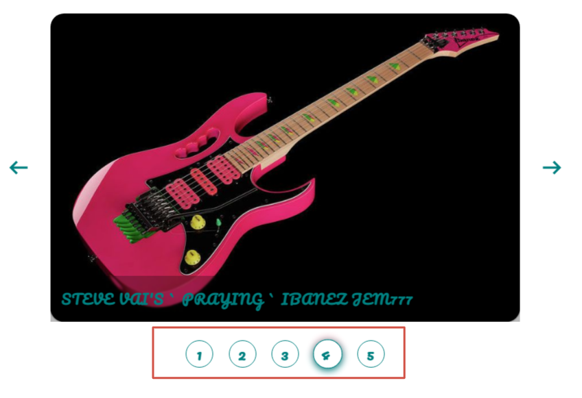

### GRI-slider is an image carousel, easy to integrate into your Javascript project

#### The following technologies were used in the development

1. scss / css - to create base styles;
2. vanilla js - to create logic and render the carousel
3. TS - for type checking;

#### 0. All source-code stored in the **"gri-slider"** folder
- index.min.css  --> pre-prepared css styles (default);
- index.js --> js-file which re-exports main Slider class and other required utils;
- fonts --> some local fonts, already integrated in default css-file
- types --> empty folder, generated after ts compilation

### SEE PREVIEW [RIGHT NOW!!](https://rakoth-gri.github.io/gri_slider/ "GRI_SLIDER IN ACTION")!

#### 1. Three simple steps to connect a carousel to your project

1. Create an HTML-markup in your index.html file with with pre-prepared classes:

```html
<section class="gri-slider">
  <!-- click for previous slide -->
  <div class="gri-slider__prev">
    <span class="material-symbols-outlined gri-slider__prev_el" id="prev">
      arrow_left_alt
    </span>
  </div>
  <!-- container for dynamic rendering of functional slider core -->
  <div class="gri-slider__body">
    <!-- RENDER -->
  </div>
  <!-- click for the next slide -->
  <div class="gri-slider__next">
    <span class="material-symbols-outlined gri-slider__next_el" id="next">
      arrow_right_alt
    </span>
  </div>
</section>
```

2. Add a pre-prepared css-file in the head element of your markup:

```html
<head>
  <!-- other meta content -->
  <!-- specify the root to gri-slider folder in your project -->
  <link rel="stylesheet" href="./gri-slider/index.min.css" />
</head>
```

3. Import a AutoSlider class into your main.js file, as shown below:

- connection js-file to html:

```html
<head>
  <!-- specify the root to your index.js file: -->
  <script src="./index.js" defer type="module"></script>
</head>
```

- inside your index.js:

```javascript
// specify the root to 'gri-slider' folder in your project:
import AutoSlider from "./gri-slider/index.js";

// invoke the AutoSlider class with options:

new AutoSlider({
  list: MY_SLIDE_LIST, // required
  options: { fontFamily: "Montserrat", color: "orangered" }, // optional
  isAutoSlider: true, // optional
  panel: ["renderDots"], // optional
  imgInSlideCount: 1, // optional
});
```

- the most simple way to start using Slider:

```javascript
// specify the root to 'gri-slider' folder in your project:
import AutoSlider from "./gri-slider/index.js";

new AutoSlider({ list: MY_SLIDE_LIST });
```

#### 2. Let's talk about the options we can pass into **_AutoSlider_** class

#### 2.1 'list' - the only required property for creating a dynamic carousel. This is an Array of objects kind of:

```javascript
const MY_SLIDE_LIST = [
  {
    // required prop
    slideImg: "https://remote-site.com/picture1.jpg",
    // optional prop
    comment: "comment for picture1",
    // optional prop
    controlImg: "./src/my-icons/icon.svg",
  },
  {
    slideImg: "https://remote-site.com/picture2.jpg",
  },
  {
    slideImg: "https://remote-site.com/picture3.jpg",
    comment: "comment for picture3",
  },
];

new AutoSlider({ list: MY_SLIDE_LIST });
```

As we can see above, each item of **MY_SLIDE_LIST** potentially has three props:

- **slideImg** defines the path to the picture of carousel
- **comment** defines the comment to a specific picture
- **controlImg** defines the type of icon for slider panel stylizing. **It's enought to define 'controlImg' prop only in zero-index item of list prop array**

Typing each prop in the **list** item:

```typescript
interface I_LIST_ITEM {
  // required prop
  slideImg: string;
  // optional prop
  comment: string | null | undefined;
  // optional prop
  controlImg: string | null | undefined;
}
```

#### 2.2 'options' - the optional property for customizing styles of main container (.gri-slider). This is a javascript CSSStyleDeclaration object:

```javascript
{
    fontFamily: "Montserrat", // inherited CSS-prop
    color: "orangered", // inherited-CSS prop
    width: '700px',
    textAlign: 'center' // inherited-CSS prop
}

new AutoSlider({
  list: SLIDE_LIST,
  options: { color: "teal", letterSpacing: "1.2px", fontFamily: "Pacifico, cursive" },
  panel: ["renderDots"],
});
```

Picture, that illustrates the options object styles above:


**By default: the 'fontFamily' prop attached for the main .gri-slider container is 'Montserrat'**

Types of values for a single prop in options object:

- **[CSSStyleProp]** --> string | number | undefined

Options property uses inline-styles for main slider container (.gri-slider). <br>
Attention: **if the property is inherited, all the descendants of slider container will inherit the prop's value!**
<br>

**By default: {}**

#### 2.3 'isAutoSlider' - the optional property activating the automatic change of images in the carousel:

```javascript
new AutoSlider({
  list: MY_SLIDE_LIST, // required
  isAutoSlider: true, // optional
});
```

You can dynamically **stop / restart** the automatic slides change by **entering / leaving** mouse cursor to the carousel image area:


Types of values for the prop:

- **isAutoSlider** --> boolean | undefined

**By default: false**

#### 2.4 'imgInSlideCount' - the optional property which determines the number of images within a single slide:

```javascript
new AutoSlider({
  list: MY_SLIDE_LIST, // required
  imgInSlideCount: 2, // optional
});
```

- This picture demonstrates the code above:
  

Types of values for CSS-prop:

- **imgInSlideCount** --> number | undefined

**By default: 1**

#### 2.5 'panel' - the optional property which connects the slider control panel.

The property is a single-length string Array, determines the appearance of the control panel.

```javascript
new AutoSlider({
  list: MY_SLIDE_LIST, // required
  panel: ["renderDots"], // optional
});
```

Types of values for CSS-prop:

- **panel** --> ("renderDots" | "renderControls")[]

Attention, if your choice is **'renderControls'** - you can also specify the icon for the control item: simply indicate the **icon url** for **controlImg** field in the first item of **list** prop Array:

```javascript
const MY_SLIDE_LIST = [
  // first item of 'list' Array!
  {
    // required prop
    slideImg: "https://remote-site.com/picture1.jpg",
    // optional prop - defines the image icon for all control buttons
    controlImg: "./src/my-icons/icon.svg",
  },
];
```

- Panel with "renderDots" value:
  

- Panel with "renderControls" value:
  

- Panel with "renderControls" value and with enable 'controlImg' prop of **list** item:
  

**By default: disabled**

#### 2.6 'delay' - the optional property in milliseconds, allows you to set the frequency of switching images in the carousel.

```javascript
new AutoSlider({
  list: MY_SLIDE_LIST, // required
  delay: 3000, // optional in milliseconds
});
```

**By default: 1500**

#### 3. A few words about customizing html markup of gri-slider:

In the markup below you see a recommended structure with pre-prepared html classes and id's. Almost all element's selectors are
cooperated with source-code files! Please, Do not change it!
<br>
But, You can easily change the icon-font tags or add your img tags:

```html
<!-- NOTE! All selectors that provide working functionality have remained unchanged -->

<section class="gri-slider">
  <div class="gri-slider__prev">
    <!-- add your icon-font-image to display prev arrow -->
    <i class="my-icon-font-class gri-slider__prev_el" id="prev">
      my_arrow_left_icon
    </i>
  </div>
  <!-- container for dynamic rendering of functional slider core -->
  <div class="gri-slider__body">
    <!-- RENDER -->
  </div>
  <div class="gri-slider__next">
    <!-- add your svg to display next arrow -->
    
  </div>
</section>
```

#### 3. A few words about customizing styles of gri-slider:
You can always customize styles by modifying the styles attached in **index.min.css** file

The media-querries grid,suggested in pre-prepared **index.min.css** file, below: 

```css

@media screen and (max-width: 1399.98px) {
  /* props */
}        

@media screen and (max-width: 1199.98px) {
  /* props */
}           
       
@media screen and (max-width: 991.98px) {
  /* props */
}
       
@media screen and (max-width: 767.98px) {
  /* props */
} 
                    
@media screen and (max-width: 575.98px) {
  /* props */
}
```

#### 4. The main Slider class includes method, that allows automatically adjusting of the carousel to different screen resolutions